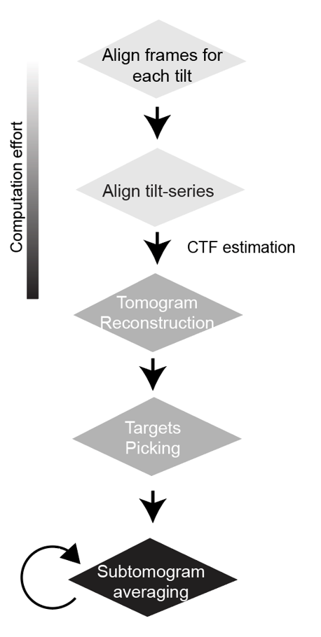

Cryo-Tomography Data Processing's Manual
========================================

This is my personal notebook for data processing - workflow ranges from data acquisition to subtomogram averaging and modeling.

There are many different software packages used for data processing. 

The following is the current workflow to subtomogram averaging:

Guide for Software and Installation
===================================

.. toctree::

   Home <self>
   installation
   imod_install

Subtomogram averaging workflow
==================================

Help
====

Useful script is at my repository on GitHub: `<https://github.com/hongzhan2015/cryoet>`_
